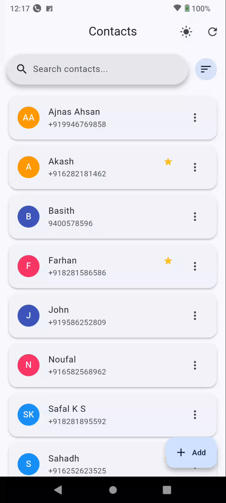
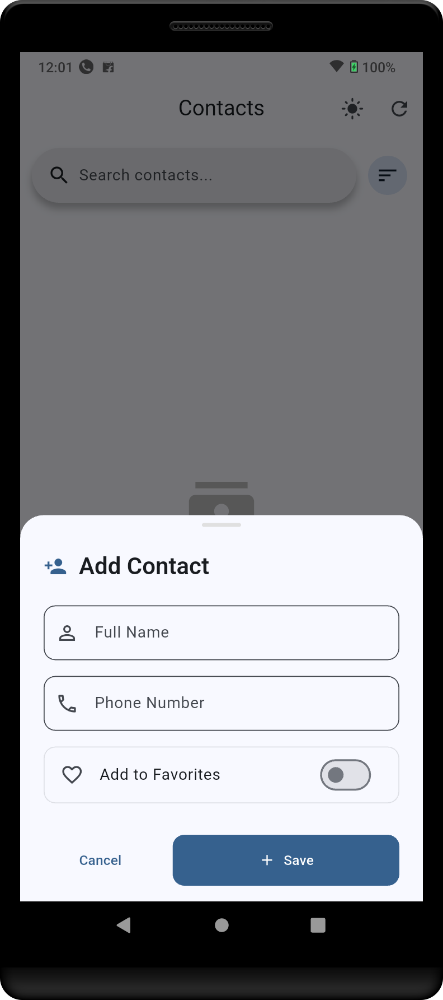
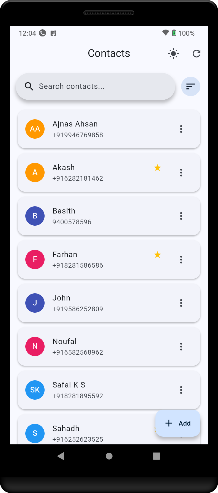
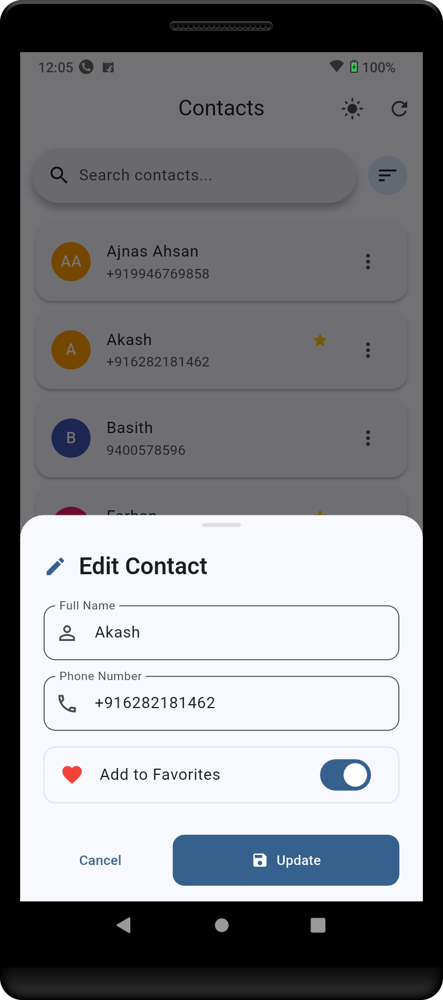
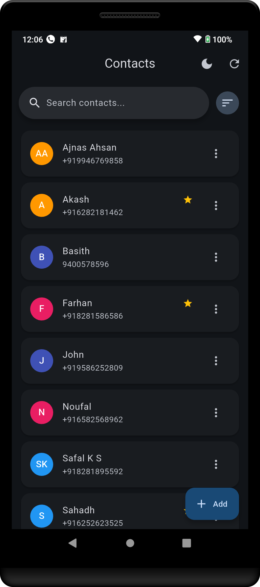

# phone_book_app

Production-ready Flutter + Supabase Phone Book App.

## Overview

This app is a lightweight, responsive Phone Book built with Flutter and Supabase.
It supports fast CRUD operations, real-time search, favorites, and a clean UI that
works great on mobile. State management is powered by Riverpod.

## Features

- View Contacts: List all contacts with name and phone
- Add Contact: Form with validation (name, phone)
- Edit Contact: Update existing contact details
- Delete Contact: Confirm and remove contact
- Search: Real-time search by name or phone
- Favorites: Mark/unmark contact as favorite
- Recently Added: Sort by most recently added (created_at)
- Fast Performance: Optimized renders and network calls
- Dark Mode: System-aware with manual toggle via provider

## Tech Stack

- Flutter (Material 3)
- Supabase (Postgres + REST)
- Riverpod for state management
- flutter_dotenv for environment variables

See `pubspec.yaml` for exact versions:
- flutter_riverpod ^2.6.1
- supabase_flutter ^2.9.1
- flutter_dotenv ^6.0.0

## Project Structure

```
lib/
  core/
    env.dart               # Reads SUPABASE_URL, SUPABASE_ANON_KEY
    theme/theme_provider.dart
    utils/
  features/
    contacts/
      data/
        data_sources/contact_remote_datasource.dart
        models/contact_model.dart
      domain/
        entities/...
      presentation/
        providers/contact_provider.dart
        screens/
          contact_list_screen.dart
          add_contact_screen.dart
        widgets/
          contacts_searchbar_section.dart
          delete_conf_dialog.dart
          sort_bottom_sheet.dart
  main.dart                 # App entry, Supabase init, theme & routing
```

## Supabase Setup

1) Create a new Supabase project and copy the Project URL and anon public key.

2) Create the `contacts` table (SQL):

```sql
create table if not exists public.contacts (
  id uuid primary key default gen_random_uuid(),
  name text not null,
  phone text not null,
  is_favorite boolean not null default false,
  created_at timestamptz not null default now()
);
```

3) Development access (choose one):

- Quick start: Disable RLS for `contacts` while testing (not for production).

```sql
alter table public.contacts disable row level security;
```

- Recommended: Keep RLS enabled and add permissive policies for anon during development:

```sql
alter table public.contacts enable row level security;
create policy "Anon can read contacts" on public.contacts
  for select using (true);
create policy "Anon can insert contacts" on public.contacts
  for insert with check (true);
create policy "Anon can update contacts" on public.contacts
  for update using (true);
create policy "Anon can delete contacts" on public.contacts
  for delete using (true);
```

## Environment Variables

Create a `.env` file at the project root (already bundled via `pubspec.yaml`):

```
SUPABASE_URL=your_supabase_project_url
SUPABASE_ANON_KEY=your_supabase_anon_public_key
```

Loaded in `main.dart` via `flutter_dotenv` and read by `core/env.dart`.

## Running the App

1) Flutter setup: install Flutter (latest stable) and device/emulator
2) Install dependencies:

```
flutter pub get
```

3) Run:

```
flutter run
```

The app initializes Supabase in `main()`:

```dart
await dotenv.load();
await Supabase.initialize(url: Env.supabaseUrl, anonKey: Env.supabaseAnonKey);
```

## How It Works

- Data Source: `ContactRemoteDataSource` performs CRUD on the `contacts` table
- Model: `ContactModel` maps rows to Dart objects (`fromMap`, `toMap`)
- State: `contactProvider` (Riverpod `StateNotifier`) exposes `AsyncValue<List<ContactModel>>`
- UI: `ContactListScreen` (home) lists, searches, sorts; `AddContactScreen` creates/edits
- Dark Mode: `themeModeProvider` supports system/dark/light; toggle via `ThemeModeNotifier`

## Performance Notes

- Lean network calls: `select().order('created_at')`
- Optimistic delete with rollback on failure
- Fine-grained updates: list mapping on update to avoid full reload
- Material 3 + Riverpod minimize rebuilds

## 🎥 Demo


---

## 📱 Screenshots

| Add Contact | Contacts List |
|-------------|---------------|
|  |  |

| Edit Contact | Sort Contacts |
|--------------|---------------|
|  |  |

| Dark Mode |
|-----------|
|  |
